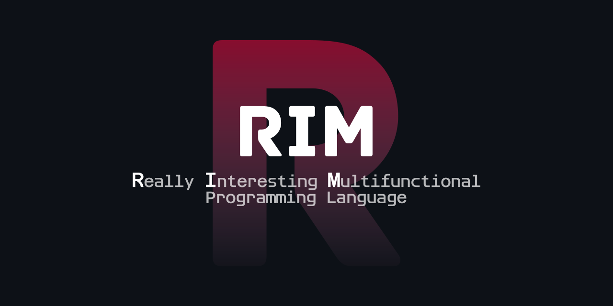

# 

[![CI][ci-badge]][ci]
[![Coverage][coverage-badge]][coverage]
[![Downloads][downloads-badge]][downloads]
[![Chat][discord-badge]][discord]

## Contents

- [The Rim Programming Language](#)
  - [Contents](#contents)
  - [What is this?](#what-is-this)
  - [When should I use it?](#when-should-i-use-it)
  - [Quick Start](#quick-start)
  - [Installing from Source](#installing-from-source)
    - [Building on a Unix-like system](#building-on-a-unix-like-system)
    - [Building on Windows](#building-on-windows)
  - [Building Documentation](#building-documentation)
  - [Getting Help](#getting-help)
  - [Contributing](#contributing)
  - [License](#license)

## What is this?

This is the main source code repository for [Rim][rim-website] (**R**eally **I**nteresting **M**ultifunctional Programming Language).

It will contain the compiler, standard library, and documentation at some point ;).

## When should I use it?

**TODO**

## Quick Start

**TODO**

## Installing from Source

### Building on a Unix-like system

1. Make sure you have installed these dependencies:

   - **TODO**
   - ...deps

2. Clone the [source] with `git`:

   ```sh
   git clone https://github.com/rim-lang/rim.git
   cd rim
   ```

[source]: https://github.com/rim-lang/rim

3. Build and install: **TODO**

### Building on Windows

**TODO**

## Building Documentation

**TODO**

```sh
./todo.sh
```

The generated documentation will appear under `doc` in the `build` directory for
the ...

**TODO**

## Getting Help

The Rim community can be found in a few places:

- its actually just me :(
- Discord: [CreatorSiSo#3434][discord]

## Contributing

If you are interested in contributing to the Rim project, please take a look at [CONTRIBUTING.md](./CONTRIBUTING.md).

## License

Rim is distributed under the terms of the MIT license.

See [LICENSE](LICENSE), and [COPYRIGHT](COPYRIGHT) for details.

<!-- Badge Links -->

[ci]: https://github.com/rim-lang/rim/actions
[ci-badge]: https://img.shields.io/github/workflow/status/rim-lang/rim/Rust?logo=github&logoColor=fff&style=for-the-badge
[coverage]: todo
[coverage-badge]: https://img.shields.io/codacy/coverage/todo?logo=codecov&logoColor=fff&style=for-the-badge
[downloads]: todo
[downloads-badge]: https://img.shields.io/github/downloads/rim-lang/rim/total?logo=github&logoColor=fff&style=for-the-badge
[discord]: https://discord.com/users/628224045191528459
[discord-badge]: https://img.shields.io/discord/689918873947996171?label=discord&logo=discord&logoColor=fff&style=for-the-badge

<!-- Other Links -->

[rim-website]: https://www.todo.com
[getting-started]: https://docs.todo.com/getting-started
[rimc-dev-guide]: https://rimc-dev-guide.todo.com
